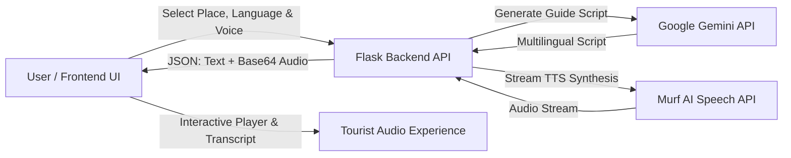

# 🌍 AI Travel Guide & Audio Companion

[](https://www.python.org/)
[](https://flask.palletsprojects.com/)
[](https://ai.google.dev/)
[](https://murf.ai/)
[](https://render.com/)
[](https://tailwindcss.com/)

> An intelligent, multilingual AI-powered travel guide and audio companion that generates immersive tourist summaries and realistic voice narrations for iconic destinations around the world.

---

## 📸 Key Highlights

- 🏛️ **Smart Destination Intelligence**: Generates historical overviews, architectural highlights, cultural contexts, and visitor tips using **Google Gemini**.
- 🎙️ **Studio-Quality Voiceover**: Converts generated tourist guide text into lifelike speech using **Murf AI (Falcon TTS Model)**.
- 🌐 **Multilingual Support**: Explore destinations in **English**, **Hindi (हिंदी)**, **Tamil (தமிழ்)**, and **Telugu (తెలుగు)**.
- 🎭 **Customizable Experience**: Toggle between **Summary** (~200 words) and **Detailed Storytelling** (~400 words) with **Male/Female voice personalities**.
- ⚡ **High Availability & Fault Tolerance**: Built-in multi-model fallback cascade and exponential backoff retry to handle API spikes seamlessly.
- 🚀 **Unified Production Build**: Single full-stack deployment ready for **Render**, **Railway**, or **Docker** with zero CORS headaches.

---

## 🏗️ Architecture & Workflow



---

## 🛠️ Tech Stack

| Layer | Technology | Description |
| :--- | :--- | :--- |
| **Frontend** | HTML5, Tailwind CSS, Vanilla JS (ES6+) | Modern, glassmorphic responsive UI with interactive destination cards, search filter, and custom audio player. |
| **Backend** | Python 3, Flask, Flask-CORS | REST API serving generation endpoints and full-stack static assets. |
| **Generative AI** | Google GenAI SDK (`gemini-3.8-flash`) | Context-aware storytelling and structured tourist guides. |
| **Voice Synthesis**| Murf AI API (`FALCON` Engine) | Low-latency neural streaming text-to-speech. |
| **Production WSGI**| Gunicorn | Production-grade WSGI HTTP server. |
| **Hosting** | Render.com | Automated CI/CD deployment from GitHub. |

---

## 📁 Project Structure

```text
TRAVEL-GUIDE-APP/
├── Backend/
│   ├── app.py              # Flask server, Gemini AI integration & Murf TTS handlers
│   └── requirements.txt    # Backend dependencies
├── Frontend/
│   ├── index.html          # Responsive landing page & audio player UI
│   └── index.js            # Client state management, API requests & DOM events
├── .env.example            # Environment variables template
├── .gitignore              # Ignored files (keys, venv, cache)
├── app.py                  # Root WSGI entrypoint for Cloud Deployments
├── wsgi.py                 # Alternative WSGI hook
├── Procfile                # Gunicorn deployment process file
├── render.yaml             # Infrastructure-as-code for Render deployment
└── requirements.txt        # Top-level dependencies for cloud builds
```

---

## 🚀 Getting Started Locally

### 1. Prerequisites
- **Python 3.10+** installed on your system.
- API Key from [Google AI Studio](https://aistudio.google.com/).
- API Key from [Murf AI](https://murf.ai/api).

### 2. Clone the Repository
```bash
git clone https://github.com/saisrikarbommisetty/TRAVEL-GUIDE-APP.git
cd TRAVEL-GUIDE-APP
```

### 3. Create a Virtual Environment & Install Dependencies
```bash
# Create virtual environment
python -m venv venv

# Activate virtual environment
# On Windows:
venv\Scripts\activate
# On macOS/Linux:
source venv/bin/activate

# Install dependencies
pip install -r requirements.txt
```

### 4. Configure Environment Variables
Create a `.env` file in the root directory:
```env
GEMINI_API_KEY=your_google_gemini_api_key
MURF_API_KEY=your_murf_api_key
PORT=5000
```

### 5. Run the Application
```bash
python app.py
```
Open your browser and navigate to **`http://127.0.0.1:5000`**.

---

## 🌐 Deploy to Render (Free Cloud Hosting)

This repository is already configured with [`render.yaml`](./render.yaml) and [`Procfile`](./Procfile) for seamless 1-click deployment.

1. Fork or push this repository to your GitHub account.
2. Go to [Render Dashboard](https://dashboard.render.com/) and click **New +** $\rightarrow$ **Web Service**.
3. Connect your GitHub repository.
4. Set the configuration:
   - **Environment**: `Python 3`
   - **Build Command**: `pip install -r requirements.txt`
   - **Start Command**: `gunicorn app:app`
5. In **Environment Variables**, add:
   - `GEMINI_API_KEY` = `<your_gemini_api_key>`
   - `MURF_API_KEY` = `<your_murf_api_key>`
6. Click **Deploy Web Service**!

---

## 🌍 Supported Languages & Voice Profiles

| Language | Locale | Female Voice | Male Voice |
| :--- | :--- | :--- | :--- |
| **English** | `en-US` | Alicia | Matthew |
| **Hindi (हिंदी)** | `hi-IN` | Namrita | Aman |
| **Tamil (தமிழ்)** | `ta-IN` | Abirami | Murali |
| **Telugu (తెలుగు)** | `te-IN` | Josie | Zion |

---

## 🤝 Contributing

Contributions, issues, and feature requests are welcome!
1. Fork the Project
2. Create your Feature Branch (`git checkout -b feature/AmazingFeature`)
3. Commit your Changes (`git commit -m 'Add some AmazingFeature'`)
4. Push to the Branch (`git push origin feature/AmazingFeature`)
5. Open a Pull Request

---

## 📄 License

This project is licensed under the **MIT License** - see the LICENSE file for details.

---

<div align="center">
  <sub>Built By Sai Srikar for travelers and explorers around the globe.</sub>
</div>
